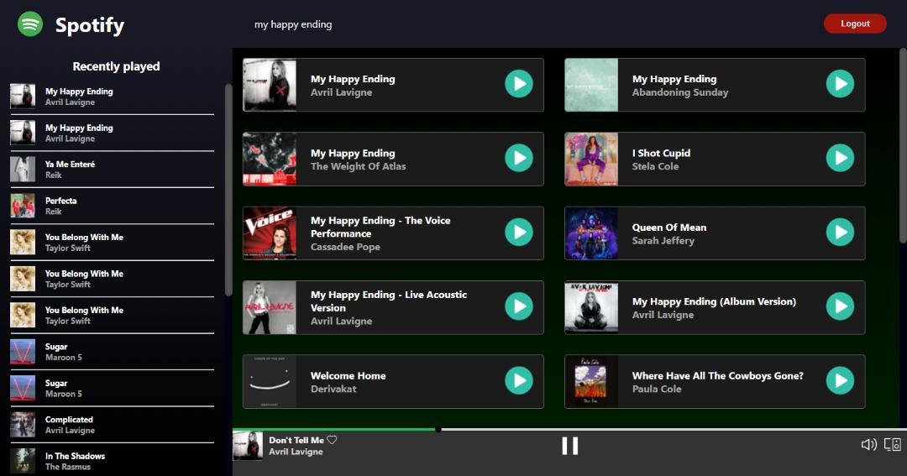
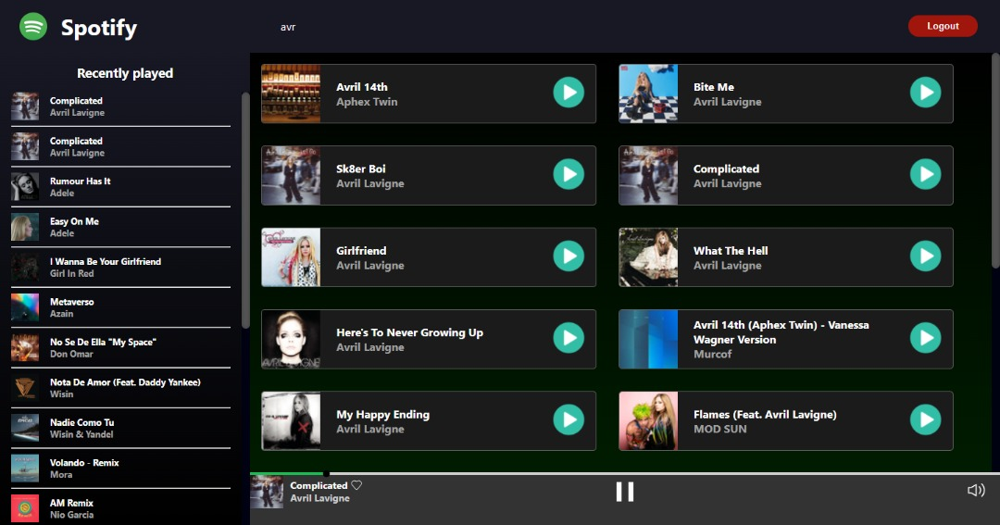
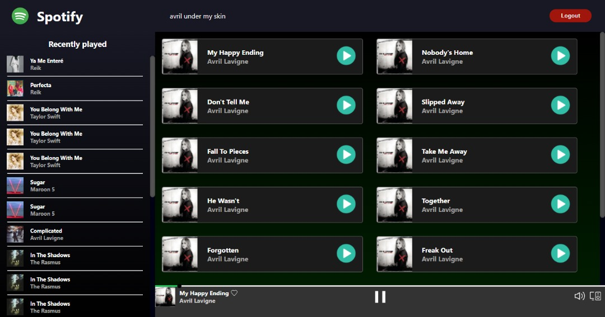

# Spotify app - Test eClass

## Preview

### Search by song title

### Search by song artist

### Search by song album

## Installation and Setup Instructions

Clone down this repository. You will need `node` and `yarn` installed globally on your machine.

Installation:

`yarn install`

To Run the dev server:

`yarn start`

To Visit App:

Open [http://localhost:3000](http://localhost:3000) to view it in the browser.

## Configuration

### Local configuration

You must change the variable id_client in the authSlice from Store for the code provided by SPOTIFY in your Dashboard (Additionally, the account must be Premium to be able to access and play the songs) in order to be authorized.

You must also change REDIRECT_URI in the Login Component to `http://localhost:3000/dashboard` for the address that the production server has, you must also change it in the Spotify Dashboard at the following address:

- Edit Settings > Redirect URIs
- Set `http://localhost:3000/dashboard` and press ADD
- Save the changes

### Server configuration

You must change the variable id_client in the authSlice from Store for the code provided by SPOTIFY in your Dashboard (Additionally, the account must be Premium to be able to access and play the songs) in order to be authorized.

You must also change REDIRECT_URI in the Login Component to `https://<url_server>` for the address that the production server has, you must also change it in the Spotify Dashboard at the following address:

- Edit Settings > Redirect URIs
- Set `https://<url_server>` and press ADD
- Save the changes

## Demo

[Demo spotify](https://joeypy.github.io/React-eClass/)

Note: The demo will not work correctly unless you enter your credentials correctly and also the same person logs in to the application, this is due to the limitations of the api.

